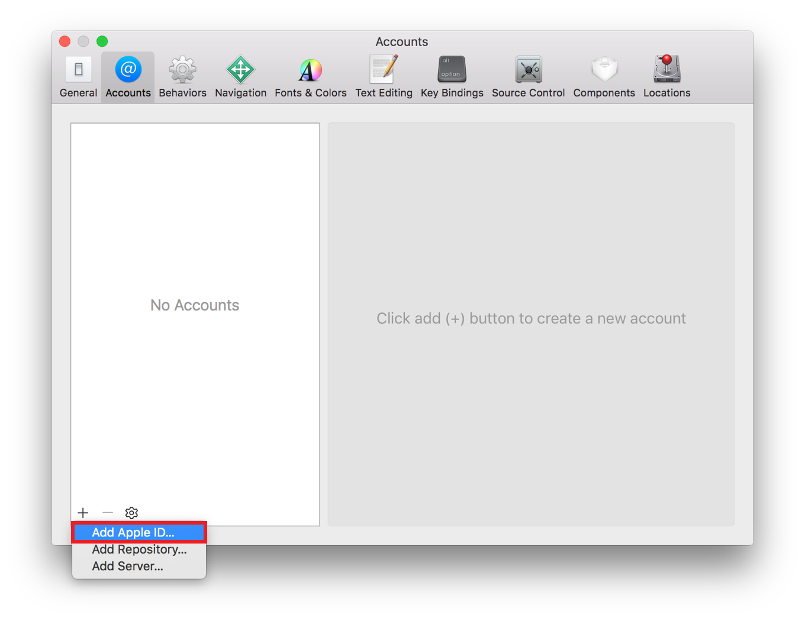

### Generate a Code Signing Certificate

First you have to add your Apple ID to Accounts preferences in Xcode. If you are already done with this, you can skip to step 6.

1. Start Xcode
2. Select Xcode > Preferences from the navigation bar.
3. At the top of the window select `Accounts`.
4. Click on the `+` on the lower left corner and select `Add Apple ID...`

5. A dialog will appear. Add your Apple ID and your password, then select `Sign in`. If you don't have an account you can create your Apple ID by selecting `Create Apple ID`.

6. Select your Apple ID and your team 
7. Click on `Manage Certificates`
8. Right-Click on each certificate and click `Export Certificate`

### Create an Xcode app by building Ionic

1. Clone your Ionic app 
2. Open your cloned project folder in terminal
3. Run `ionic cordova build ios`
4. After the build is complete go to the project folder, then platforms/ios/PROJECTNAME.xcodeproj
5. Double click on the project to open it in Xcode

### Download a Provisioning Profile with Xcode

1. Select Xcode > Preferences menu.
2. At the top of the window select Accounts.
3. Select your Apple ID and your team, then select Download Manual Profiles.
4. Go to ~/Library/MobileDevice/Provisioning Profiles/ and your profiles should be there.

