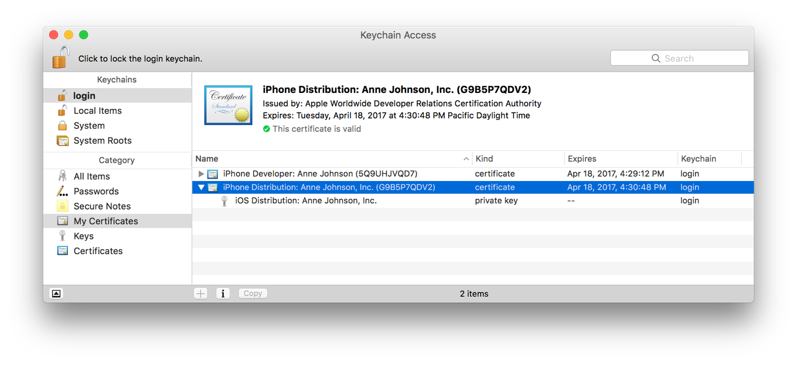

## Exporting with codesigndoc

The easiest way to collect these files is to use [Bitrise's](https://www.bitrise.io/?utm_source=ioscodesigning.com&utm_medium=content&utm_campaign=ios_code_signing&utm_term=ioscodesigning.com/exporting-code-signing-files&utm_content=text) open source [codesigndoc tool](https://github.com/bitrise-tools/codesigndoc). This tool runs a clean Archive on your Mac, and analyzes the Xcode log output to see which code signing files Xcode used during the Archive.

For **Xcode projects** use the following command:

```
bash -l -c "$(curl -sfL https://raw.githubusercontent.com/bitrise-tools/codesigndoc/master/_scripts/install_wrap-xcode.sh)"
```

For **Xamarin project** us the following command:

```
bash -l -c "$(curl -sfL https://raw.githubusercontent.com/bitrise-tools/codesigndoc/master/_scripts/install_wrap-xamarin.sh)"
```

This will archive your project and locate all the required code signing files and provisioning profiles and export it to a directory for you.

!!! warning
    Because `codesigndoc` does a full code archiving and exporting to generate an IPA, make sure you can build and archive your project. Otherwise it won't be able to locate the files for you

1. Start your Terminal app on your macOS.
2. Run the one liner command above for your project type.
3. The script will download and start itself. It will ask for your Xcode project file. Select the `xcodeproj`, or `xcworkspace` you are using with the Finder app and simply drag and drop it to the Terminal.

4. The script will parse your project and show all the available schemes or configurations.
5. Select the one you are using.
6. The `codesigndoc` tool will export all the required code signing files and provisioning profiles for you and open up a Finder window with all of them.

!!! success
        You can upload your code signing files to [Bitrise](https://www.bitrise.io/?utm_source=ioscodesigning.com&utm_medium=content&utm_campaign=ios_code_signing&utm_term=ioscodesigning.com/exporting-code-signing-files&utm_content=text) after you're done with the export and manage signing from there automatically, only by selecting targets, or even resigning during a build. [Give it a try!](https://www.bitrise.io/?utm_source=ioscodesigning.com&utm_medium=content&utm_campaign=ios_code_signing&utm_term=ioscodesigning.com/exporting-code-signing-files&utm_content=text)

## Exporting certificates

### Exporting using Xcode
1. Start Xcode
2. Select Xcode > Preferences from the navigation bar.
3. At the top of the window select `Accounts`.
4. Select your Apple ID and your team from the right side bar, then click on `View Details...`.
5. A dialog will appear where you will see your code signing identities and the provisioning profiles.
6. Select the certificates and choose `Export` from the pop-up menu.

7. Enter a filename in the Save As dialog. You can set a password and a verification to store it securely, but it's not necessary.
8. Xcode will export the requested certificate in .p12 format.

### Exporting manually
1. Start Keychain Access.
2. On the top left sidebar select `login` and on the bottom left select `My Certificates`.
3. This will list all your installed certificates and the associated private key.
4. Select the one that you would like to export and choose `Export` from the pop-up menu.

7. Enter a filename in the Save As dialog. You can set a password and a verification to store it securely, but it's not necessary.
8. Keychain Access will export the requested certificate in .p12 format.


## Exporting Provisioning Profiles

### Exporting using Xcode
1. Start Xcode
2. Select Xcode > Preferences from the navigation bar.
3. At the top of the window select `Accounts`.
4. Select your Apple ID and your team from the right side bar, then click on `View Details...`.
5. A dialog will appear where you will see your code signing identities and the provisioning profiles.
6. Locate the profile that you are looking for under Provisioning Profiles.
7. If you don't have it installed on the system, click on the `Download` button next to it.
8. Choose `Show in finder` from the pop-up menu, that will show you the installed provisioning profile for you.

### Exporting manually
1. Go to [https://developer.apple.com](https://developer.apple.com) and log in.
2. Select Certificates, Identifiers & Profiles from the left sidebar
3. Navigate to Provisioning Profiles > All
4. Find the Provisioning Profile you are looking for from the list or use the search to filter.
5. Click on the selected Provisioning Profile, this will expand the details.
6. If its status is invalid, you can click on the `Edit` button and save again.
7. Click on the `Download` button to download it and double click to install on your macOS.

!!! note
    You can also locate all installed Provisioning Profiles at the following path: `~/Library/MobileDevice/Provisioning Profiles/`.

[^1]: Screenshots from https://developer.apple.com/support
